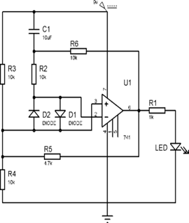
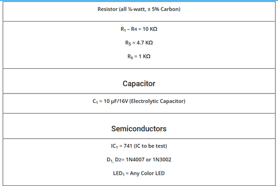
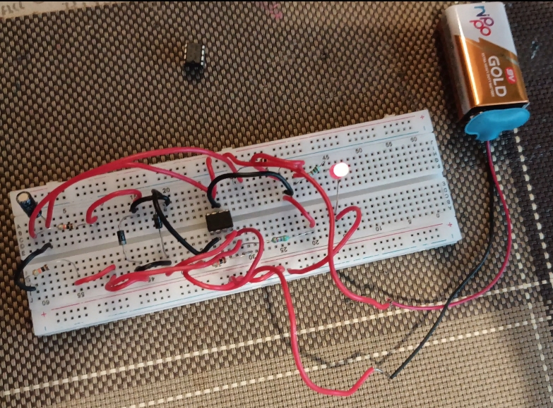

# Operational Amplifier IC741 Tester

## Project Overview
The **Operational Amplifier IC741 Tester** is a project designed to test the functionality of the IC741 operational amplifier. The project includes the necessary components and a testing circuit to ensure the IC741 is operating as expected.

## Features
- **Test Circuit for IC741**: Includes a basic test circuit to check the functionality of the IC741 op-amp.
- **Component Analysis**: Detailed analysis of the IC741 operational amplifier.
- **Testing Procedure**: Step-by-step guide to test the op-amp using the provided setup.
- **Images & Diagrams**: Visual representations of components, circuits, and testing setup.

## Components
- **IC741 Operational Amplifier**
- **Resistors**
- **Capacitors**
- **Power Supply**
- **Multimeter (for measurements)**

## Circuit Diagram
The circuit diagram is designed to test the input and output characteristics of the IC741. It ensures the op-amp is amplifying the signal correctly.

## Setup & Procedure
1. **Assemble the Circuit**: Follow the circuit diagram to assemble the testing setup.
2. **Power the Circuit**: Provide the appropriate power supply to the circuit.
3. **Testing**: Use a multimeter to check the output voltage and verify the op-amp’s functionality.

## Images

### IC741 Component

### Testing Setup

