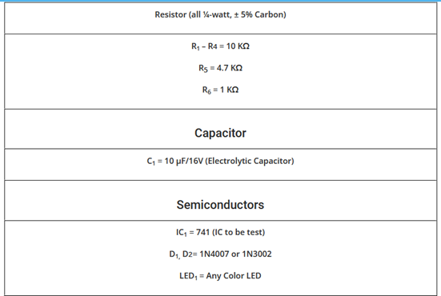
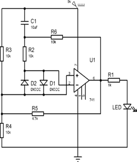
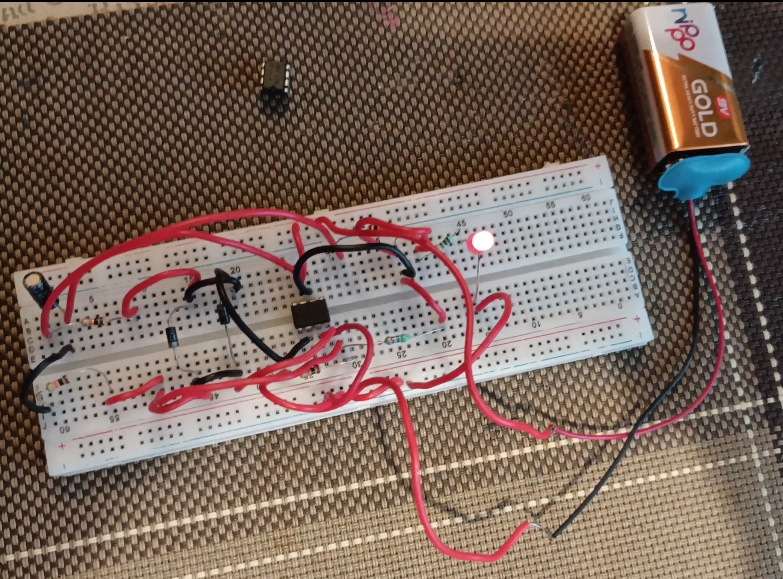

# 🔬 Operational Amplifier IC741 Tester

  

<b>An Electronic Circuit for Testing the Functionality of the IC741 Operational Amplifier</b>

---

## 📖 Overview

The **Operational Amplifier IC741 Tester** is a simple electronic project designed to verify whether an **IC741 Operational Amplifier** is functioning correctly. The circuit uses passive components, diodes, and an LED indicator to quickly identify a working or faulty IC741.

This project is ideal for electronics students, hobbyists, and laboratory testing.

---

# ✨ Features

- ✔️ Tests IC741 Operational Amplifier
- ✔️ Simple breadboard implementation
- ✔️ Low-cost components
- ✔️ LED status indication
- ✔️ Easy to build
- ✔️ Suitable for educational use

---

# 📚 Theory

## What is an Operational Amplifier?

An Operational Amplifier (Op-Amp) is a high-gain differential amplifier that amplifies the voltage difference between two input terminals. It is widely used in signal amplification, filtering, voltage comparison, oscillators, and analog computing.

The **IC741** is one of the most commonly used general-purpose operational amplifiers because of its simplicity, reliability, and versatility.

---

## Working Principle

The IC741 is connected in a comparator-like configuration. The resistor-capacitor network and diodes generate reference voltages at the input terminals.

When a healthy IC741 is inserted:

- The amplifier responds correctly.
- The output switches as expected.
- The LED glows, indicating the IC is functional.

If the IC is faulty:

- The output remains unstable or fixed.
- The LED does not glow correctly.

---

# ⚙️ Components Required

| Component | Value |
|-----------|-------|
| IC741 | Operational Amplifier |
| R1 – R4 | 10 kΩ |
| R5 | 4.7 kΩ |
| R6 | 1 kΩ |
| C1 | 10 µF / 16V |
| D1, D2 | 1N4007 / 1N3002 |
| LED | Any Color |
| Battery | 9V |

---

# 🔌 Circuit Diagram

---

# 🛠️ Hardware Setup

---

# ⚡ Testing Procedure

1. Assemble the circuit.
2. Insert the IC741.
3. Connect the 9V battery.
4. Observe the LED.
5. If the LED glows, the IC741 is working correctly.
6. If the LED remains OFF, the IC may be faulty.

---

# 📊 Result

The tester successfully verifies whether an IC741 operational amplifier is functional. The LED provides a simple visual indication, allowing faulty ICs to be identified quickly and accurately.

---

# 💡 Applications

- Electronics Laboratory Experiments
- IC Testing
- Analog Circuit Verification
- Educational Demonstrations
- Component Troubleshooting

---

# 🚀 Future Improvements

- LCD Status Display
- Automatic IC Detection
- PCB Version
- Rechargeable Battery
- Digital Voltage Measurement

---

# 👨‍💻 Author

**Joshua Greg Colaco**

GitHub: **https://github.com/joshua14134**

---

# 📄 License

This project is licensed under the MIT License.

⭐ If you found this project useful, please consider giving it a **Star**.
